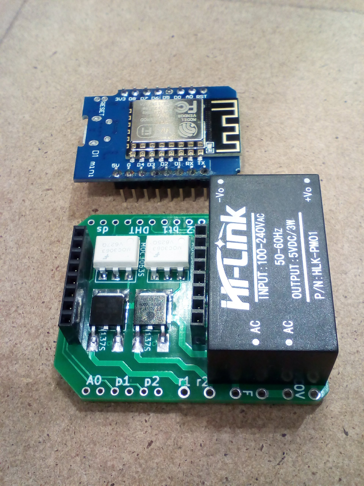
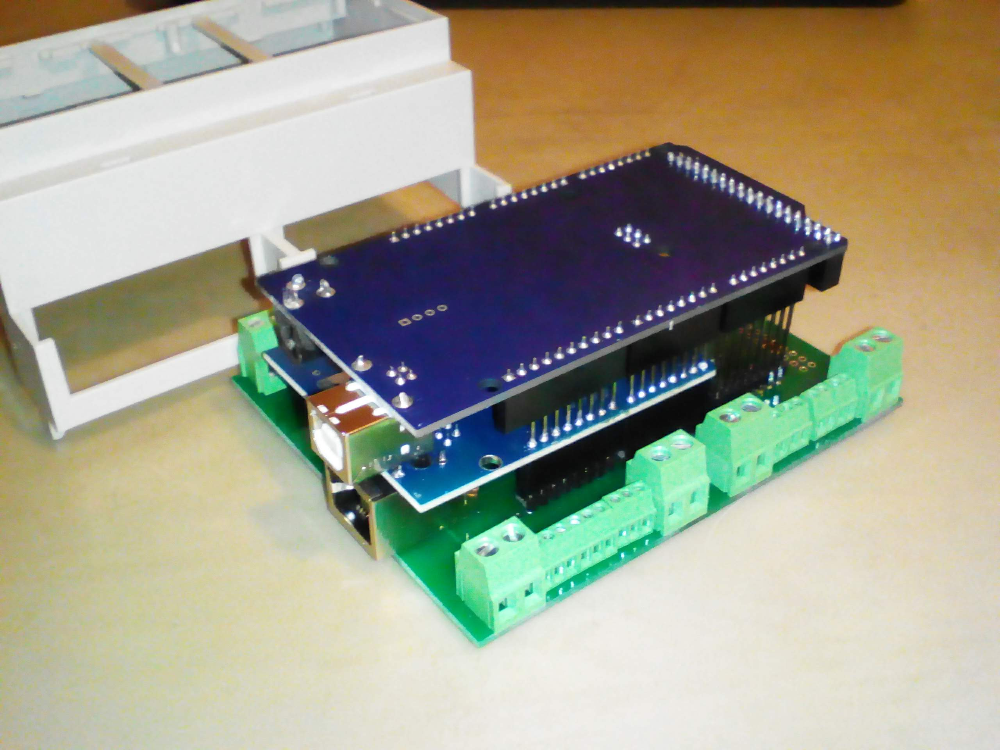
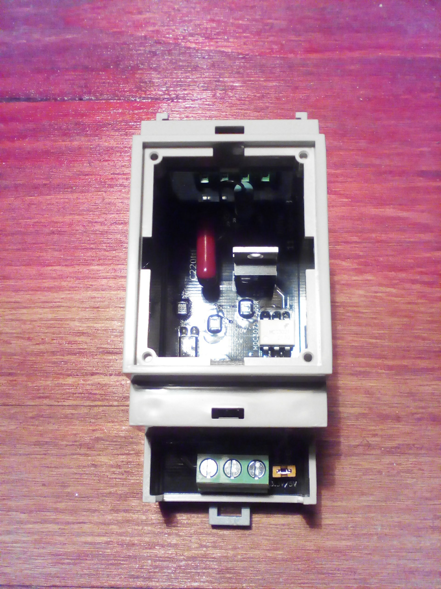
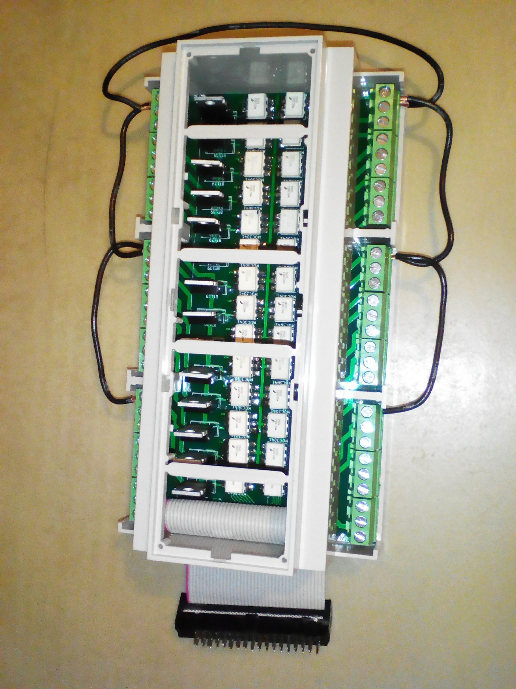

# hjhome
**new version** ☺️
  see branch: testing

# hjmqtt
https://github.com/hjltu/hjmqtt
  MQTT client, bridge between my mqtt devices and other systems, like homekit2mqtt, Homeassistant, OpenHUB etc.

**more documents and instructions**
https://github.com/OSA83/hjhome-doc

# hjconnect
https://github.com/hjltu/hjconnect
  Remote telemetry system  for raspberry pi

# sima
https://github.com/hjltu/sima
 Yandex voice assistant for home automation control
 https://youtu.be/XiIFVnCSt-M

# my home automation devices
 
 1. wifi controller(wemos)</b>
 https://github.com/hjltu/wemos-wifi-controller
 https://github.com/hjltu/hjmqtt/tree/master/arduino
 https://github.com/hjltu/hjmqtt/tree/master/arduino/doc
 https://youtu.be/PPkzPMNiBQY
 https://www.ebay.com/itm/254534654473
 <b>I/O port reference:</b>
 bt1,2   input for buttons (short ang long press) with impulse counter.
 ds      input for ds18b20 sensor (temperature sensor).
 DHT     input for DHT22 (temperature, humidity sensor).
 A0      analog input for any analog devices(CO,CO2,luminosity).
 p1,2    pwm outputs, for dimmers and motorizer curtains control(Somfy) 
 L1,2    triac outputs, AC current (light, jalousie).
 
 
<b>2. lan controller(arduino mega)</b>
 https://github.com/hjltu/hjmqtt/tree/master/arduino
 https://github.com/hjltu/hjmqtt/tree/master/arduino/doc
 https://www.ebay.com/itm/254015934717
 <b>I/O port reference:</b>
 A0-A16           input for buttons (between bt and GND)
 D14-D21          input for ds18b20 sensor (temperature sensor).
 D14-D21          input for DHT22 (temperature, humidity sensor).
 A0-A6            analog input for any analog devices.
 D2-D9,D11-D13    pwm outputs.
 D22-D49          triac outputs (220 volt).
 D10,D50-D53      lan network W5100
 
test: 
 mosquitto_sub -h test.mosquitto.org -t /mega11/# -v
 mosquitto_pub -h test.mosquitto.org -t /mega11/in/echo -m hello!
 
 <b>3. Triac dimmer, PWM input 3.3v/5v, 1kHz min.</b>
 https://youtu.be/Dj-iw9Rz5CE
 https://www.ebay.com/itm/254046916040
 https://github.com/hjltu/hjmqtt/tree/master/arduino
 
  
<b>4. 28 channel solid-state relay (triac BT-139)</b>
 
